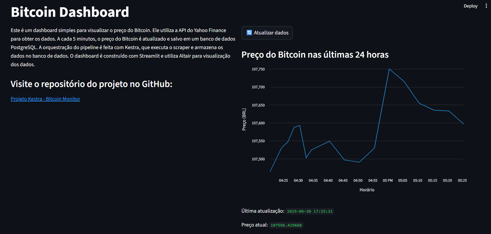
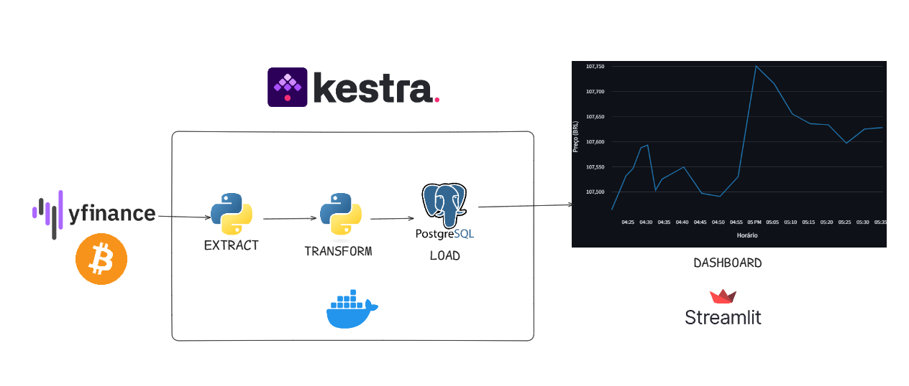

# Monitor de Preço de Bitcoin com Kestra e Streamlit

Este projeto monitora o preço do Bitcoin em tempo real, armazena os dados em um banco de dados PostgreSQL e os exibe em um dashboard interativo construído com Streamlit. A orquestração do pipeline de dados é feita com o Kestra.

## Dashboard



## Arquitetura



## Funcionalidades

- **Coleta de Dados:** Busca o preço do Bitcoin a cada 5 minutos utilizando a biblioteca `yfinance`.
- **Armazenamento:** Salva o histórico de preços em um banco de dados PostgreSQL.
- **Orquestração:** Utiliza o Kestra para automatizar o processo de coleta e armazenamento de dados.
- **Visualização:** Apresenta um dashboard com o histórico de preços das últimas 24 horas, 7 dias, ou todo o período, atualizável em tempo real.

## Como Executar

Existem duas maneiras de executar o projeto:

### 1. Com Docker Compose (Recomendado)

Esta abordagem utiliza o Docker Compose para orquestrar todos os serviços (Kestra, PostgreSQL e Streamlit) de forma automática.

**Passo 1: Iniciar os Serviços**

O `docker-compose.yml` irá configurar e iniciar os contêineres do Kestra, PostgreSQL e da aplicação Streamlit.

```bash
docker-compose up -d --build
```

**Passo 2: Configurar Variáveis no Kestra KV Store**

1. Acesse a interface do Kestra em `http://localhost:8080`.
2. No menu lateral, vá para "KV Store".
3. Crie as seguintes chaves e preencha com os valores correspondentes:
   - `DB_HOST`: `postgres`
   - `DB_PORT`: `5432`
   - `DB_NAME`: `kestra`
   - `DB_USER`: `kestra`
   - `DB_PASSWORD`: `k3str4`

**Passo 3: Configurar o Flow no Kestra**

1. Acesse a interface do Kestra em `http://localhost:8080`.
2. Crie um novo "Flow".
3. Copie o conteúdo do arquivo `flows/bitcoin_flow.yml` e cole no editor do Kestra.
4. Salve e ative o Flow.

O Kestra irá executar o fluxo a cada 5 minutos, coletando e salvando o preço do Bitcoin.

**Passo 4: Acessar o Dashboard**

Acesse `http://localhost:8501` no seu navegador para ver o dashboard.

### 2. Execução Manual

Você pode executar o script de coleta de dados e a aplicação Streamlit manualmente.

**Passo 1: Pré-requisitos**

- Python 3.12 ou superior
- Docker e Docker Compose (para o banco de dados) - opcional

**Passo 2: Iniciar o Banco de Dados (caso utilize o PostgreSQL local)**

Se utilizar um banco de dados externo, pule esse passo.
Inicie o container do PostgreSQL com o Docker, caso queira utilizar o banco de dados local.:

```bash
docker-compose up -d postgres
```

**Passo 3: Configurar Variáveis de Ambiente**

Crie um arquivo `.env` na raiz do projeto, baseado no `.env.example`. As variáveis padrão já estão configuradas para se conectar ao container do PostgreSQL.
Para utilizar um banco de dados externo, preencha as credenciais de acordo com o seu banco de dados.

**Passo 4: Instalar Dependências**

```bash
pip install -r requirements.txt
# ou, se você usa uv:
uv pip install -r requirements.txt
```

**Passo 5: Executar o Script de Coleta**

```bash
python src/scripts/bitcoin.py
```

**Passo 6: Iniciar a Aplicação Streamlit**

```bash
streamlit run src/app.py
```

Acesse `http://localhost:8501` no seu navegador para ver o dashboard.

## Estrutura do Projeto

```
.
├── flows/
│   └── bitcoin_flow.yml      # Definição do Flow para o Kestra
├── src/
│   ├── scripts/
│   │   └── bitcoin.py        # Script para coleta manual de dados
│   └── app.py                # Aplicação Streamlit para o dashboard
├── .env.example              # Exemplo de arquivo de variáveis de ambiente
├── docker-compose.yml        # Arquivo de configuração do Docker Compose
├── Dockerfile                # Arquivo de configuração do Docker para o Streamlit app
├── pyproject.toml            # Dependências do projeto
└── README.md                 # Este arquivo
```
